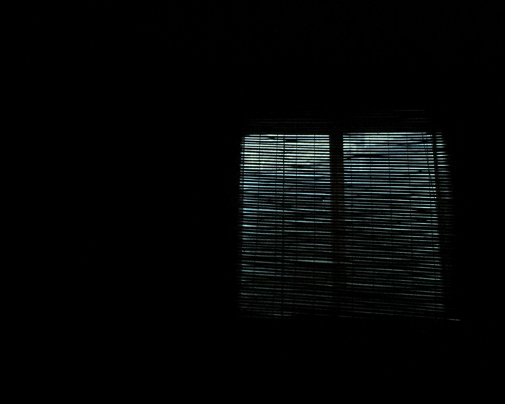

You wouldn't after think after spending hundreds of thousands of dollars on you that you'd end up at Utah Metropolitan University in grand old Mormon fucking Utah of all places. Everyone else has pretty much been the younger brother or the child that just follows along, but could you ever even imagine walking down those wooden steps as a fifty year old man and seeing this 18-year-old hunched over figure always on the computer and think "This is my son. I am proud of my son.", because I fucking can't. The same guy who had girls head over heels for him and played football and played drums and had the time of his fucking _life_, owns the best business in the country that's _not_ ranked #1 in the system that rewards the exploit of honesty and honor it would have taken get there otherwise _is the one feeling like a failure._

I couldn't in my life ever even dream of deserving a person like him. No less to be my fucking father and the amount of potential I feel like I'm missing out on even _at this moment_ is too overwhelming to not cry. The American day-dream of life is a fucking fraud— But holy shit could I not just want to be a part of it, to play catch in the backyard and to experience all that he has, just to see what it'd be like.

<small>Your own experiences are your own—but... what about 
What about what could be?</small>

<small>I keep remembering that dream he had one time, where everything was fake and that he'd wake up one day and be four years old again. I also remember how quickly I invalidated it by saying how I had it first. How much do you think it mattered to him?</small>
