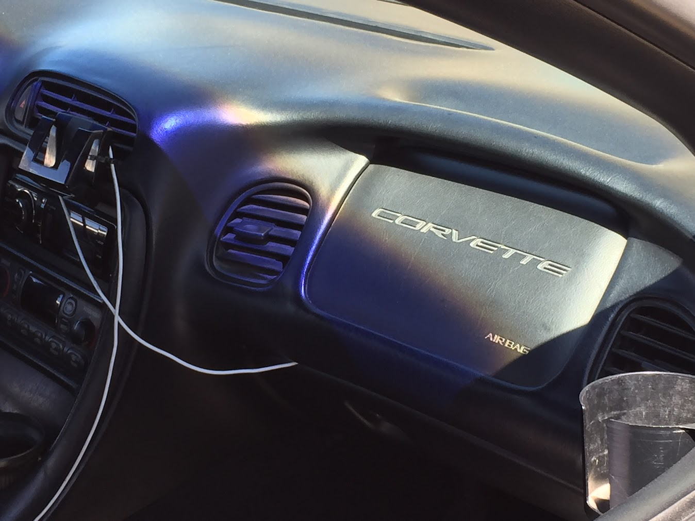

Today is Dad's last day here in the states, as I write this it's about 1:25am and he leaves 6-7am Monday morning. Pretty sad to see him go, especially since it'll be at least two more months till I see him again—and an indeterminate amount of time after that. The level of uncertainty really makes me anxious, although it's just so hard to plan that ahead.

What makes me the most anxious— more like that sick nervous feeling that weighs me down from seeing ahead or being conscious of things around me, is that he's leaving in the same fashion as the last time I saw him seven months ago. In case you forget, you cried all the way to your class and didn't a _really_ bad job at hiding it from everybody around. Maybe they understood "[that's a] _new kid_". That silvery numbness of the rental car and lighting around is still really fresh in my mind at this point. It's a very different brand of fear from what I felt in Georgia…. The dead American grass and dirt keep reminding me of that. Lots of new feelings, it's been strange to start filtering out the associations with feelings like I would the content/presentation.

Speaking of the _new_, I used to think a lot about when Dad would get gray hairs. I think Tsiuri dyes her hair for it and Deda's too young… But Dad was asking me if _I_ saw his first gray hair on his head the other day. My response was just to stumble with words and ideas as always, and he said he felt like he had one foot in the grave. Still not sure how I feel about growing old and the overly optimistic ideal of it being beautiful or whatever, but I've just realized Steve could be using a walker— or even just start losing granted things like Lynn.

I really don't want to think about it right now. 1:48am. 2:18am.

<small>It's only been about seven months but Meg's already beginning to show her character through her adolescence. She hangs with a different clique than I do, and her manner of speaking already reflects it. Really hard to change how people are once they develop anything notable: Philosophy, manners, social ticks— [Chris De la Vega](people.html#chris-de-la-vega) is making me think a lot about this stuff.</small>
