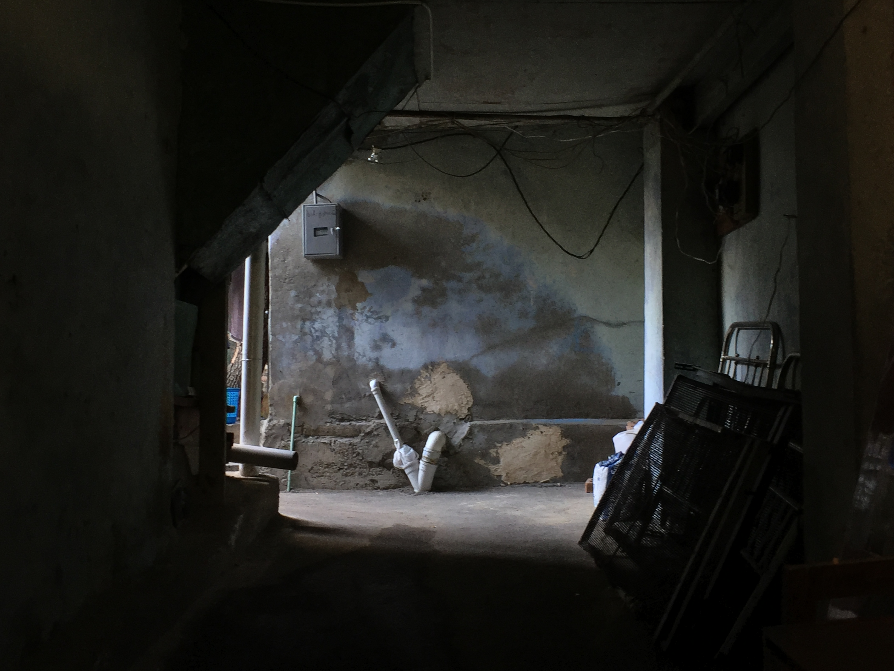

Past two people there's always a bottom-feeder. Or something, right..? Ambiguity's is the killer here. Even with two people there's a giver and a taker. Under that the contrapposto-ideal of relationships would be where both parties are perfect equals, but that's so hypocrytical to say. I love, _love_, taking. A literal vice— my only solace being that I know everyone else does too.

Every compliment and _kind_ moment is always underlayed with this bitter dust that settles. You dig too deep and it feels nauseatingly cold to be there. You dig too deep and you invalidate all that you've gotten from it. If the ending's not good, none of it is so you search and find lifeless rotten motes of... something long gone. And it all gets so much worse with people you actually like. Did you know there's people out there who don't artificially have their guard up, but instead have risen themselves higher than you, before you? There's nothing to attack or pull on. You can literally only hope that they give, all for you to take, _take_.

I push to far, say too much, invalidate others. All to exist under this weird pretense of self-betterment and objectivism? Here's an ideal. If you really want "the truth", tell yourself what the fuck it is because you're not some ghandi-motherfucker reading the stars. Selflessness, altruism— that's what others are remembered by and what you're not. You don't improve yourself for others, you selfish fuck. You give. Have something worth giving.

If at the end their eyes end up glazing over and you still say nothing, try playing the character. Maybe in the muddy pretense that is what people believe to be me, you might find something actually useful.

<small>Not everything's hidden in those vague childhood memories, those pure feelings are long gone and you're expected operate on layers on top of layers. Otherwise you'd think we all would have figured it out by now.</small>

<small>Andromeda (D.R.A.M. Special), Earth Wind and Fire - September</small>